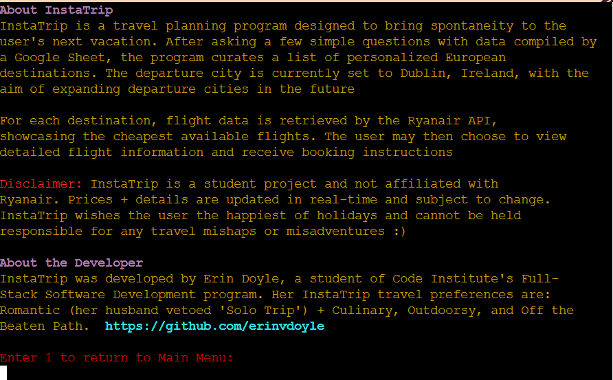

# :sunny: **InstaTrip** :sunny:
## *For When You Want to Travel, But Decision-Making Isn’t Your Thing* 

  

[Visit the deployed site](https://instatrip-ffc10cb98741.herokuapp.com/)

# **Introduction**

Crave the magic of adventure but need the security of cold, hard data? Welcome to **InstaTrip**, your source for perfectly planned travel spontaneity (courtesy of a Google Sheet)

InstaTrip asks you a few simple questions (nothing too deep), then compiles a hand-picked list of European destinations based on your preferences. Fancy a quick solo trip to Bucharest? A hen party in Amsterdam? Maybe a spicy weekend for two in Istanbul? We’ve got you covered. We'll match the occasion of your trip to your chosen interests. Shopping? *Check.* Dining? *Absolutely.* Nightlife? *Cheers!*

But that's not all, reader. **InstaTrip** even saves you the trouble of flight searching. Thanks to the Ryanair API, we’ll show you the cheapest ticket to your destination. Decision fatigue is real, so help us help you. No need to spend hours searching for flights-- that's time better spent agonizing over how to fit your entire wardrobe + toiletries into a 40cm x 20cm bag :fearful:

Don't forget your passport!

# **Table of Contents**
- [Project](#project)
  - [How to Use InstaTrip](#how-to-use-instatrip)
  - [Target Audience](#target-audience)
- [User Experience](#user-experience)
  - [User Stories](#user-stories)
  - [Site Owner's Goal](#site-owners-goal)
  - [Features to Achieve the goals](#features-to-achieve-the-goals)
  - [Program Structure](#program-structure)
  - [Flowchart](#flowchart)
  - [Database Structure](#database-structure)
      - [Google Sheet](#google-sheet)
      - [Ryanair API](#ryanair-api)
  - [Logic Flow](#logic-flow)
  - [Design Choices](#design-choices)
- [Features](#features)
- [Future Features](#future-features)
- [Technologies](#technologies)
  - [Languages](#languages)
  - [Libraries, Programs, and Tools](#libraries-programs-and-tools)
- [Testing](#testing)
  - [Code Validation](#code-validation)
  - [Feature Testing](#feature-testing)
  - [Additional Testing](#additional-testing)
  - [Bugs](#bugs)
- [Deployment](#deployment)
- [Credits](#credits)
- [Acknowledgements](#acknowledgements)
- [Contact](#contact)

# Project 

This program was created for Portfolio Project #3 (Python) for The Code Institute Full Stack Software Developer program

## How to Use InstaTrip

1. Navigate to `https://instatrip-ffc10cb98741.herokuapp.com`or [follow this link](https://instatrip-ffc10cb98741.herokuapp.com/)
2. Click the *Run Program* button at the top of the page
3. Follow the instructions on the main menu to either read *About* the program or *Start* it
4. After starting the program, answer the questions and select your vacation preferences. Then choose from the cities presented and receive the cheapest flight for your preferred destination. You may then use the booking details to select and purchase the flight from Ryanair, *Start Over* to select new cities, or *Exit* the program

## Target Audience

**InstaTrip** is intended for adults (and young people with parental supervision) of all walks of life, based in Ireland and/or within reasonable travelling distance to Dublin airport-- people who would like to explore spontaneous European travel. 

This program is designed to inspire joy. From the colors to the playful tone, whether the user is landlocked or ready for takeoff, **InstaTrip**  is for anyone who'd like a change of pace as it encourages the feelings of excitement and anticipation that accompany planning a big trip. It's to be used as inspiration, for fun, or to plot the next great escape from daily routine :sparkles:

# User Experience

## User Stories
   

   
User Stories for Instatrip (click)

   
 - **As a new visitor**, I want:
    - A simple and easily understood main menu for hassle-free navigation 
    - A step by step, methodical process that helps me choose the best destination to suit my needs
    - An intuitive process that communicates each step along the way to selecting my next vacation
    - The ability to choose the departure date that fits my schedule
    - A flexible departure date so that I can find the cheapest flights available to me
    - A suggested list of cities to visit tailored to my own preferences
    - A suggested list of cities best suited to my personal occasion for travel
    - Ideas on where to visit based on my travel interests
    - The option to ask for a new selection of cities or return to my previously suggested destinations
    - The flexibility to easily start again if I haven't been offered cities that interest me
    - Destination recommendations that take into account my travel safety and accessibility preferences
    - To be offered the most economical flight choices that fit my needs
    - Real-time flight information with an accurate reflection of prices, airports, flight numbers, and departure times
    - The information needed to book my flight
    - To be able to read about the service
    - To be able to start over or exit the program once my flight information has been generated

 - **As a returning visitor**, I want:
    - A quick and reliable city selection process
    - A variety of cities so that my city suggestions vary based on my preferences 
    - The opportunity to receive suggestions for cities I may never have thought about
    - To understand that certain cities I may not have considered are actually tailored to my preferences
    - To be able to generate new cities based on changing travel dates, flexibility, preferences, and trip occasions
    - To receive the best prices and most suitable flights regardless of my varying selections
    

## Site Owner's Goal
   

   
Site Owner's Goal (click)

  - **As the owner of the site**, I want:
    - To deliver a program with a clean, well-planned interface that seamlessly collects user preferences to predict a tailored selection of vacation destinations
    - To connect my users with the best prices for their chosen destinations and with a reputable airline, Ryanair
    - To offer a variety of choice and a fun factor that encourages repeat vists and word of mouth recommendations
    

## Features to Achieve the Goals

   
Features to Achieve the Goals (click)

   

  - **Features of the program to achieve user story goals:**
    - The starting screen of the application features a simple main menu for easy navigation
    - The user is walked through the process of entering their departure details and choosing their vacation preferences; every step is explained along the way
    - The tone of the copy and the color and decorative choices for the interface keep the process engaging and fun
    - There is a wide range for departure dates that allows users to book up to two years in advance
    - Additional departure date flexibility for the Ryanair API can be factored into finding the cheapest flight
    - A wide range of cities and the ranked suitability of each for all occasion and interest parameters offer the user exposure to many different city suggestions
    - The user is given the opportunity to draw and re-draw sets of destination cities as many times as they wish
    - Flight information is offered for each of the three selected cities so that the user can choose a city with booking details in mind
    - Booking details like flight numher and departure time are provided so that the user can locate and book their flight directly with Ryanair
    - User errors are handled at each stage of input with clear feedback so that the user can find cities and coinciding flights without issue

## Program Structure

**Instatrip** is a terminal-based application housed on a landing page and deployed by Heroku. It is driven by two core processes, each powered by an API. The first is a data collection and comparison process which measures user input against a Google Sheet of city rankings in order to determine the user's ideal European destination. The second is a flight retrieval process by which the Ryanair API selects the cheapest flight for the cities decided by the process described above.

More about each of these processes can be found in the [Flowchart](<#flowchart>) and [Database Structure]((<#database-structure>)) sections. The underlying logic and the user experience navigating through the program can be found in the [Logic Flow](<#logic-flow>) and [Features](<#features>) sections.

## Flowchart  

 Instatrip Flowchart (click) 

  
  

The flow chart for this application was originally designed with pen and paper before I began coding. I used Visio once I had an idea of the general structure and put the first few functions in place. This helped me flesh out the details, stay organized, and create the necessary bridges between functions as the logic of the program grew in complexity

## Database Structure 

### Google Sheet

 Instatrip Google Sheet (click) 

  
  
  

My introduction to Google Sheets was by Code Institute's extremely helpful *Love Sandwiches* walkthrough project. I have often said to my Business Analyst husband that I am not a "spreadsheet person." I was more than pleasantly surprised by the ease of use incorporating these Sheets into both the walkthrough and my own project, and can now officially designate myself a Sheet Believer :sparkles:

My Workbook *Instatrip* consists of a single Sheet. This Sheet is composed of 17 columns, 15 of which represent the choices for the user's travel preferences; and 43 rows, with each row representing a European city.

The column titles are as follows: City, IATA (airport code), Nightlife, History & Culure, Cuisine, Outdoorsy Experiences, Shopping, Off the Beaten Path Exploration, Romantic Adventure, Solo Travel, Hen or Stag Party, Time with Friends or Family, Overall Safety, Accessibility, Public Transportation, Tourism-Friendliness, and English-Speaking

Data to rank each city with a numeric value (1-5) and populate each of the column parameters was collected first from google, and then with the aid of ChatGPT. The program compares these rankings with the user's own ranked preferences to determine which cities make the most suitable destinations 

### Ryanair API

Ryanair API (click)

I was able to integrate the Ryanair API into this program by signing up for [Rapid API](https://rapidapi.com/DataCrawler/api/ryanair2) and subscribing through their service. This was my second experience with APIs (the first being a soft launch into them with Google Sheets in the *Love Sandwiches* walkthrough), and while the parameters and logic appeared straightforward, I spent an entire morning trying to set it up using JSON format before finally turning to AI. One struggle was in fetching the destination airport IATAs, which I eventually stored in my Google Sheet rather than in a list in *run.py*. 

Once integrated, the API made the program functional (a thrill! :woman_dancing:) and I was able to generate flight information through **InstaTrip** and find the matching flights on Ryanair.com

## Logic Flow

Logic Flow (click)

- The *run.py* file contains all functions for this program. When the site is loaded or the *Run Program* button at the top of the page is clicked, the function *main*() is called.

- *main()* clears the screen of the startup command and prints the **InstaTrip** logo, displays the *Main Menu*, and requests the user to choose a menu option: *Start*, *About*, or *Exit*. The following functions are called for this opening sequence: *colored_instatrip()*, *print_colored_background()*, and *display_menu()*

- When the user chooses the *Start* option, *display_menu()* prints the greeting message (*greeting()*), which gives the user instructions on how to use the program. *Main()* then calls the *get_trip_details()* function, which asks the user for their departure date, departure flexibility, and trip duration. This information will be passed to the Ryanair API.

- Once *get_trip_details()* has run, the user will be prompted to select their type of trip and choose their important travel factors by functions *type_of_trip()* and *important_factors()*

- This input will then be compared with the data in the *Instatrip* Google Sheet by function *rank_cities()* to order the cities most appropriate to the user's preferences. Function *select_random_cities()* randomizes the order of the cities to prevent selecting the first applicable cities from the top of the list.

- A *drumroll()* prints and the initial top city selections are displayed. The user is given the choice either to proceed, *generate_new_cities(),* or *start_over()*.

- Function *user_choice_after_ranking()* permits the user to generate three new cities as many times as they wish. The opportunity to proceed, start over, or return to the previous city selections, as stored in the *city_history* list, is given each time. 

- Once the user has selected their preferred three destinations, they are asked by the *rate_importance()* function to rate the importance of five different safety and accessibility factors. Their answers are then compared with the rankings stored in the Sheet for each city, and *adjust_city_scores()* reorders the final three cities from most suitable to least.

- From here, the user's departure data and the IATA airport codes (stored in the Sheet) for the user's selected cities are passed to the Ryanair API. This is accomplished with these functions: *get_airport_codes(), search_ryanair_flights(),* and *find_cheapest_flights()*. The cheapest applicable flight information for each city is then printed and the user may choose whether to *ask_for_flight_info()* or *exit()* the program. 

- *Exit()* prints the exit message and art, a url for a staycation article, and the option to return to the *Main Menu*. 

## Design Choices

### Color Scheme

The color and design scheme for the starting screen of **Instatrip** were chosen to give a slightly nostalgic, retro feel, reminiscent of the travel agency advertisements and city destination posters of yesteryear. The background image for the page, an island sunset, inspired the color choice for the rest of the program. 

While this project by nature limits styling liberties, I enjoyed colorizing the text and making generous use of emoji to compliment the fun, light-hearted tone set by the copy. Booking flights and tending to travel details can often be a dreary affair. The aim here is to break the tedium and usher in a bit of excitement

    
    
    
    

- Color for the text was provided by the [Colorama library](https://pypi.org/project/colorama/). The primary colors of choice were Cyan and Magenta, to compliment the background image around the mock terminal. Red was used for exception messages. Red and two tones of Yellow colorized the *Start* screen

- Emoji were taken from the [Emoji for Python library](https://pypi.org/project/emoji/). When using human emoji characters, I made every effort to choose different skintones and genders for inclusivity

### ASCII ART

- ASCII Art for the logo and exit screen has been provided by the [ASCII Art Archive](https://www.asciiart.eu/)  
    
  

  
  
  

# Features

I have aimed to give this program a logical, straightforward interface that both entertains and instructs its user, leaving little room for confusion or error

## Welcome Screen

A colorful ASCII Art logo with the name of the application and its tagline form the top of the *Welcome Screen*. Beanth the art, the *Main Menu* instructs the user to decide whether to read about **InstaTrip**, *Start* the program, or visit the *Exit* screen. The input is validated for the three correct choices: 1, 2, or 3.

  

## About

The *About* screen explains the concept of the program, briefly introduces the developer, and offers a playful disclaimer about the changing nature of flight prices. The user may press 1 to return to the *Main Menu*. Any other input returns an error message with instruction to press "1"

## Exit Screen

The *Exit* screen features ASCII Art of a tropical beach scene and a url for a staycation article, should the user be unable to travel. The user must press Enter to return to the *Main Menu*

## Greeting Message

When the user chooses *Start*, a greeting message welcomes them and explains the premise of InstaTrip. The sleep.time method allows a sequential loading of each line of text to greet the user, preventing a cluttered block of text on the CLI and giving the message a friendly, conversational feel

The screen then clears and the program advances to collect the user's departure details.

## Departure Details

After reading that InstaTrip departs out of Dublin (with new departure cities to launch "soon"), the user is prompted to enter a series of departure details: The date, their travel date flexibility, and their length of stay. User input is validated at each step

These details will be used by the Ryanair API to generate flight departure information

## Travel Preferences

Once the departure details have been collected, the user is given the opportunity to specify their type of trip: Romantic Adventure, Solo Travel, Hen or Stag Party, or Time with Friends or Family

When they have entered their choice of occasion, they are given 6 important factors in their travel preferences, of which they may choose 3. These important factors are Nightlife, History & Culture, Cuisine, Outdoorsy Experiences, Shopping, and Off the Beaten Path Exploration.

These preferences are used to determine which of the cities stored in the Google Sheet, each with their own rankings for each catagory, make the most suitable travel destinations

## Curated Destinations

Now that departure details and travel preferences have been collected, the screen clears for a drumroll effect, and the user is offered three potential vacation cities

Three options follow the cities. If the user is happy with the cities, they may proceed. If not, they can choose to see another three cities, or start the program over 

If the user chooses to view a new set of cities, they receive another list of three choices. They may then proceed, generate another new set, start the program over, or return to the previously offered cities. These options are available on a loop until either the user is pleased with their options or decides to start over. All choices are validated

## Safety and Accessibility Preferences 

Once the destination cities have been settled, they are then ranked again by the user's safety and accessibility preferences. Data from the Google Sheet is compared with the user's input to determine the order of suitability of the cities

## Flight Information

Real-time flight information for each of the three cities is then fetched and printed

The user is asked whether they would like to see booking details for any of the cities or to start the program over

## Final Flight Details

The final step of the program is to print the flight details of the user's chosen city and offer the url for Ryanair so that they may book a flight if wished

# Future Features

- A login system to store the user's previously generated cities
- A trip log and diary to record previous travel experiences
- Flexible departure locations rather than a default setting of Dublin airport
- An expanded list of European destinations
- A broader list of trip occasions to select from
- A broader list of preferred activities and interests to select from
- Opening the program to destinations outside of Europe
- Partnerships or tie ins with hotel and car rental accomodations
- Curated experience and activity suggestions
- Flight selection from multiple airlines rather than solely Ryanair
- A proper, clickable link to make a flight booking (currently prevented by Heroku)

# Technologies

## Languages Used

- [Python](https://www.python.org/) - Provides application functionality
- [html](https://developer.mozilla.org/en-US/docs/Web/HTML) - Provides the template for the mock terminal
- [CSS](https://developer.mozilla.org/en-US/docs/Web/CSS) - Styles the template, including the chosen background image
- [JavaScript](https://www.javascript.com/) - Provides the script which runs the mock terminal in the browser

## Libraries, Programs, and Tools

### Python Modules

#### Library Imports:

- [datetime](https://docs.python.org/3/library/datetime.html) - Handles date-based calculations for user travel date
- [os](https://docs.python.org/3/library/os.html) - Clears the terminal
- [random](https://docs.python.org/3/library/random.html#module-random) - Selects elligible cities randomly rather than sequentially
- [textwrap](https://docs.python.org/3/library/textwrap.html#module-textwrap) - Formats text for *About* section to avoid broken lines
- [time](https://docs.python.org/3/library/time.html#module-time) - Creates "Sleep" pauses to break up lines of text for readability and flare
- [timedelta](https://docs.python.org/3/library/datetime.html#datetime.timedelta) - Class of datetime. Sets date range for departure date

#### Third-Party Imports: 

- [colorama](https://pypi.org/project/colorama/) - Adds color and styles to the project text
- [emoji](https://pypi.org/project/emoji/) - Adds emoji icons to the project
- [gspread](https://pypi.org/project/gspread/) - Stores and Retrieves data from Google Sheets
- [HTTPAdapter](https://pypi.org/project/http-adapter/) - Manages HTTP connections with the Ryanair API
- [requests](https://pypi.org/project/requests/) - Sends HTTP requests to the Ryanair API
- [Retry](https://pypi.org/project/retry2/) - Configures automatic retries for failed network requests to the Ryanair API
- [Ryanair API](https://pypi.org/project/ryanair/) - Provides flight information 

#### Other Tools:

- [ASCII Art Archive](https://www.asciiart.eu/) - Provides logo and exit screen ASCII art
- [ChatGPT](https://openai.com/chatgpt/) - Assisted in ranking tourist destinations by chosen criteria for Google Sheet
- [Freepik](https://www.freepik.com) - Supplies the landing page background image
- [Github](https://github.com/) - Hosts the code for the site
- [Gitpod](https://www.gitpod.io/#get-started) - Provides the workspace to create and edit the site
- [Google Sheets](https://workspace.google.com/products/sheets/) - Hosts the city data for the application
- [Heroku](https://www.heroku.com) - Deploys the application
- [Icons8](https://icons8.com/) - Supplies the favicon
- [Mistral AI](https://mistral.ai) - For troubleshooting Ryanair API implementation
- [Rapid Api](https://rapidapi.com/) - Integrates the Ryanair API for flight information
- [Visio]( https://www.microsoft.com/en-us/microsoft-365/visio/visio-in-microsoft-365) - For creating the README flowchart

# Testing

## Code Validation

| W3C Validator | views.html | 
|--------------|------------|
| html         | Pass       |

| W3C Validator | views.html | 
|--------------|------------|
| CSS         | Pass       |

| PEP8 Python De-linter | run.py | 
|--------------|------------|
| python         | Pass       |

- I ran the views.html page housing the terminal through the [W3 validator](https://validator.w3.org/) after changing the background. Thankfully, this adjustment caused no errors and the page passed validation through the W3C validators for html and CSS

- JavaScript for this project has been provided by Code Institute and has not been altered from the base code; I have not validated it

- The [PEP8](https://pep8ci.herokuapp.com/) Python de-linter helped me de-lint (and caused some initial concern!) my code at several points along development

### HTML Validation

    
HTML Validation Screenshot (click)

    [W3C HTML Validator](https://validator.w3.org/)

     
     
No errors were returned

  

### CSS Validation

    
HTML Validation Screenshot (click)

    [W3C CSS Validator](https://validator.w3.org/)

     
     
No errors were returned

  
  

### Python Validation

    
Python Validation Screenshot (click)

    [PEP8 Python De-Linter](https://) 

     
     
     
No errors returned. etc

  

## Feature Testing 

### Feature Testing Table

 
A Table of Feature Tests (click)

| Feature                     | Test Case                 | Expected Response                   | Outcome                   |
|-----------------------------|---------------------------|---------------------------|---------------------------|
| Favicon | Load Site | Palm Tree icon and title appear in tab | Pass
| **Welcome Screen**  |
| "Please choose an option (1, 2 or 3)" | Enter various numbers, letters/words, press *Enter* | Exception message and redirection  | Pass |
| "Please choose an option (1, 2 or 3)" | Enter 1 | Calls greeting() | Pass |
| "Please choose an option (1, 2 or 3)" | Enter 2 | Calls read_about() | Pass |
| "Please choose an option (1, 2 or 3)" | Enter 3 | Calls exit() | Pass |
| **About Screen 2**  |
| "Enter 1 to return to Main Menu | Enter various numbers, letters/words, press *Enter* | Exception message and redirection | Pass | 
| "Enter 1 to return to Main Menu | Enter 1 | Calls display_menu() | Pass | 
| **Exit Screen**  |
| Press *Enter* to return to main menu | Enter various numbers, letters/words | Exception message and redirection | Pass |
| Press *Enter*to return to main menu | Press *Enter* | Calls display_menu() | Pass |
| **Departure Details**  |
| Please enter a date in YYYY-DD-MM format | Enter various numbers, letters/words, press *Enter* | Exception message and redirection | Pass |
| Please enter a date in YYYY-DD-MM format | Enter a valid date | User asked for flexibility_response | Pass |
| Are you flexible with your departure date? Yes/no | Enter various numbers, letters/words, press *Enter* | Exception message and redirection | Pass |
| Are you flexible with your departure date? Yes/no | Enter Yes | Ask user for flexibility_days | Pass |
| Are you flexible with your departure date? Yes/no | Enter No |  Ask user for length_of_stay | Pass |
| How many days of departure flexibility do you have? | Enter various numbers, letters/words, press *Enter*  | Exception message and redirection | Pass |
| How many days of departure flexibility do you have? | Enter 1, 2, or 3 | Ask user for length_of_stay | Pass |
| How many days do you plan to stay? | Enter various incorrect numbers, letters/words, press *Enter*  | Exception message and redirection | Pass |
| How many days do you plan to stay? | Enter a number between 1 and 59  | Calls type_of_trip() | Pass |
| **Travel Preferences**  |
| Please enter the most applicable choice for your trip (1-4) | Enter various incorrect numbers, letters/words, press *Enter* | Exception message and redirection | Pass |
| Please enter the most applicable choice for your trip (1-4) | Enter 1, 2, 3, or 4 | Selection is noted and important_factors() called | Pass |
| Select up to three important factors | Enter various incorrect numbers, letters/words, press *Enter* | Exception message and redirection | Pass |
| Select up to three important factors | Enter various combinations of 1-6 with up to three numbers chosen | Selection noted; rank_cities() and select_random_cities run to trigger drumroll() and display destinations | Pass |
| **Curated Destinations**  |
| Are you happy with these cities? (1,2, or 3) | Enter various incorrect numbers, letters/words, press *Enter* | Exception message and redirection | Pass |
| Are you happy with these cities? (1,2, or 3) | Enter *1* (yes) | rate_importance() is called | Pass |
| Are you happy with these cities? (1,2, or 3) | Enter *2* (no, let's see another three cities) | call generate_new_cities()  | Pass |
| Are you happy with these cities? (1,2,3, or 4) | Enter *4* (return to previous cities) | Return to previous cities stored in city_history[] | Pass |
| Are you happy with these cities? (1,2, or 3) | Enter *3* | Return user to Main Menu | Pass |
| **Safety and Accessibility Preferences**  |
| Rate the importance of each factor 1-5 | Enter various incorrect numbers, letters/words, press *Enter* | Exception message and redirection | Pass |
| Rate the importance of each factor 1-5 | Enter 1-5 for each prompt | call adjust_city_scores() | Pass |
| **Flight Information**  |
| Would you like to see booking instructions for any of these flights? | Enter various incorrect numbers, letters/words, press *Enter* | Exception message and redirection | Pass |
| Would you like to see booking instructions for any of these flights? | Enter 1,2, or 3 | Prints flight information generated by Ryanair API for *selected_flight* | Pass |
| Would you like to see booking instructions for any of these flights? | Enter 4 (*start over*) | User returned to *Main Menu* | Pass |
| **Final Flight Details**  |
| Press *Enter* to return to Main Menu | Enter various incorrect numbers, letters/words | Exception message and redirection | Pass |
| Press *Enter* to return to Main Menu | Press *Enter* | calls display_menu() | Pass |

### Feature Testing Images

Exception handling has been implemented to ensure smooth user interactions, validating all inputs and preventing errors or misdirection. These feature testing images reflect that input handling process.

  
Testing the Welcome Screen (click)
 

- User input is validated and no alphanumeric entry or keypress other than **1, 2**, or **3** is accepted
- Incorrect input results in a request for correct input

  
Testing the About Screen (click)
 

- User input is validated and no alphanumeric entry or keypress other than pressing **1** is accepted
- Incorrect input results in a request for correct input

  
Testing the Exit Screen (click)
 

- User input is validated and no alphanumeric entry or keypress other than pressing **Enter** is accepted
- Incorrect input results in a request for correct input

  
Testing the Departure Details Section (click)
 

- User input is validated and no alphanumeric entry or keypress outside of the specified format is accepted
- Incorrect input results in a request for correct input

  
Testing the Travel Preferences Section (click)
 

- User input is validated and no alphanumeric entry or keypress outside of the specified format is accepted
- Incorrect input results in a request for correct input

  
Testing the Destinations Section (click)
 

- User input is validated and no alphanumeric entry or keypress outside of the specified format is accepted
- Incorrect input results in a request for correct input
- User may choose to generate new cities and receives three new cities
- User may return to previous selection, request new selection, proceed to *Safetyand Accessibility* preferences, or start over

  
Testing the Safety and Accessibility Preferences Section (click)
 

- User input is validated and no alphanumeric entry or keypress outside of the specified format is accepted
- Incorrect input results in a request for correct input

  
Testing the Flight Information Section (click)
 

- Flight information is generated for the user's final choice of cities
- User input is validated and no alphanumeric entry or keypress outside of the specified format is accepted
- Incorrect input results in a request for correct input

  
Testing the Final Flight Details Section (click)
 

- User input is validated and no alphanumeric entry or keypress outside of the specified format is accepted
- Incorrect input results in a request for correct input
- The user successfully returns to *Main Menu* after pressing *Enter*

## Additional Testing

### Lighthouse

  
Lighthouse Test Results: Mobile and Desktop (click)
 

The site scores well with Lighthouse with scores of 100 for acessibility and SEO and a 96 for best practices 

### WAVE Testing

  
WAVE Web Accessibility Evaluation Tool (click)
 

No errors found with WAVE testing; the site performs well for accessibility with good contrast and use of aria labels

### Accessibility

- I have added meta data to the head of the views.html page

- Accessibility preferences are considered in the program's city safety and accessibility rankings in the Google Sheet. The user is asked to rank the importance of accessibility factors for their travel preferences so that the program may determine which cities are most suitable

### Browser Compatability

**InstaTrip** has been tested for functionality and appearance in the following browsers on desktop. No visual or functional errors occurred 

 - Google Chrome
 - Microsoft Edge

### Responsiveness

Due to the specifications of the mock terminal, responsiveness was not required for this project. I have run the program on desktop, laptop, and mobile, and have found that it does not perform properly on mobile devices

### Manual Testing

- This program was tested on my and my husband's latops, HP Elitebook and Dell Latitude 5430, and performed as designed

- Testing on mobile was also performed but I quickly determined that the provided mock terminal does not perform as expected on mobile devices

# Bugs

## Solved Bugs

  
Linebreak Issue After De-Linting (click)

This bug, and the next, are representative of numerous errors returned after my first attempt to de-lint my python code after using the Pep 8 de-linter. While initially concerning, this issue was easily rectified by removing "\n" and manually creating a line break after the opening parenthesis

  
Linebreak Issue #2 After De-Linting (click)

Another issue with a linebreak. This was resolved by making a manual linebreak after the opening parenthesis

  
TypeError:  Can only concatenate list to list (click)

This was a carelessness error as I tried to concatenate the "options" list with "Style.NORMAL." I removed the latter to solve the error

  
KeyError: 'regularFare' (click)

Nothing like an eleventh hour bug on a function that's worked dozens of times. Searching flight information for Vilnius, Lithuania seemed to upset the Ryanair API and the "regularFare" key was not found in the "flight" dictionary. To solve this, I wrote an if statement for the code to skip over any flights missing the regularFare key

## Unsolved Bugs

After implementing the above solutions and running all code through the necessary validators, I am pleased to report no bugs remain

## Further Areas of Note

- I have read that the Code Institute mock terminal does not function properly in Safari. I have been unable to test this myself on a laptop or desktop as I own Windows devices. I can attest that the program does not perform properly on mobile Safari on iPhone, but that is also the case with mobile Chrome. I was not able to implement a solution for this issue as it appears to stem from the terminal and not this program

- I was unaware until I first deployed my project that Heroku would not allow link generation within the CLI terminal. I began the program with the intention of providing a booking link for users and had already written the function, ask_for_booking(), which was functional in my GitPod IDE. I had also included a link to a staycation article for the exit screen: 

  
Creating a link worked in the IDE but not Heroku (click)

I have now simply instructed the user to type either the staycation URL into their browser or to search [ryanair.com](https://www.ryanair.com) with the provided flight information

# Deployment

## To Deploy The Project on Heroku

  
How to Deploy with Heroku(click)
 

This site was deployed through [Heroku](https://www.heroku.com/)

1. Sign up for a Heroku account and log in
2. On the dashboard, select New and then choose Create new app
3. Choose a unique app name, pick a region, and click Create app
4. Open the Settings tab within the newly created app
5. In the Config Vars section, click Reveal Config Vars
6. To enable Google Sheets, add a config variable with the key CREDS and paste the contents of the creds.json file as the value
7. Add another config variable, setting PORT as the key and 8000 as the value
8. Under Config Vars, click Add buildpack. Choose Python and save it, then add another buildpack, selecting Node.js. Make sure the buildpacks appear in this order
9. Go to the Deploy tab at the top
10. Select GitHub as the deployment method and connect your GitHub account
11. Find and connect the repository by searching for its name
12. Optionally, turn on automatic deploys to trigger deployment whenever updates are pushed to the repository
13. Finally, click Deploy Branch to deploy the project immediately

## To Fork The Repository on GitHub

  
How to fork the **InstaTrip** repository (click)

To make a copy of a repository, fork it through Github:

1. Find the repository either by using the search bar or by navigating to the URL [/erinvdoyle/instatrip](https://github.com/erinvdoyle/instatrip)
2. Once on the repository main page, navigate to the "Fork" button in the upper-right corner, between the "Watch"("Unwatch" in the image as I am the repository owner and watcher) and "Star" buttons

3. Click the "Fork" button to create a copy of the repository. This copy be altered without affecting the source code

## Creating A Local Clone of The Project

  
How to create a local clone (click)

To clone the repository of this site:

1. Click the "Code" button in your forked repository

2. Copy the repository URL (HTTPS, SSH, or GitHub CLI)
3. Open a terminal (or command prompt) on your computer

 

4. Type the following command: git clone https://github.com/erinvdoyle/instatrip.git to create a local clone

# Credits

## Content

- Code Institute's [Love Sandwiches](https://github.com/erinvdoyle/love_sandwiches) walkthrough project was used as a reference to connect **InstaTrip** to Google Sheets
- The [Code Institute Template](https://github.com/Code-Institute-Org/p3-template) provided everything needed for the mock terminal in the browser

## Technical Content

All tutorials used have been credited throughout the code. Tutorials were consulted as a jumping off point and code was manipulated to perform per my own design and specification

### Python Tutorials

- ["Clear the terminal in Python" Tutorial](https://stackoverflow.com/questions/2084508/clear-the-terminal-in-python)
- ["Exception & Error Handling in Python" Tutorial](https://www.datacamp.com/tutorial/exception-handling-python)
- ["How Do I Create a Scoring System in Python" - Stack Overflow](https://stackoverflow.com/questions/50115873/how-do-i-create-a-scoring-system-in-python)
- ["How to Handle a Python Exception within a Loop" Tutorial](https://www.tutorialspoint.com/how-to-handle-a-python-exception-within-a-loop)
- ["Python Datetime" Tutorial](https://www.w3schools.com/python/python_datetime.asp)
- ["Python Random Module" Tutorial](https://www.w3schools.com/python/module_random.asp)
- ["Sort Using Lambda in Python"](https://sparkbyexamples.com/python/sort-using-lambda-in-python/) 

## Media
### Image Credits

- [Main Image by FreePik](https://www.freepik.com/free-vector/gradient-beach-sunset-landscape_4636385.htm)
- [Retro Logo Inspiration by Sundhar on Dribble](https://dribbble.com/shots/7900685-Retro-Logo-Design)

# Acknowledgements

- My mentor, Precious Ijege, for helping me make sure all my exceptions were handled, providing kind guidance from project inception to completion, and allowing me to see the project with fresh eyes.
- Our cohort standup leader, Kay Welfare, for providing a weekly dose of enthusiasm and encouragement
- The CI Hackathon staff and my Elevate Hackathon teammates (Team ResuMates!) for inspiration and the opportunity to experience working as part of a team
- My husband, Taylor, process mapper extraordinaire, for helping me tighten up my flow chart. And *especially* for taking care of our horses and household during Storm Ashley to allow me long hours to complete the bulk of this project

# Contact

Thank you for viewing this project. Please feel free to contact me with any questions, comments, or opportunities
  
 - [erin.v.doyle@gmail.com](mailto:erin.v.doyle@gmail.com)
 - [linkedin.com/erinvdoyle](https://linkedin.com/erinvdoyle)
