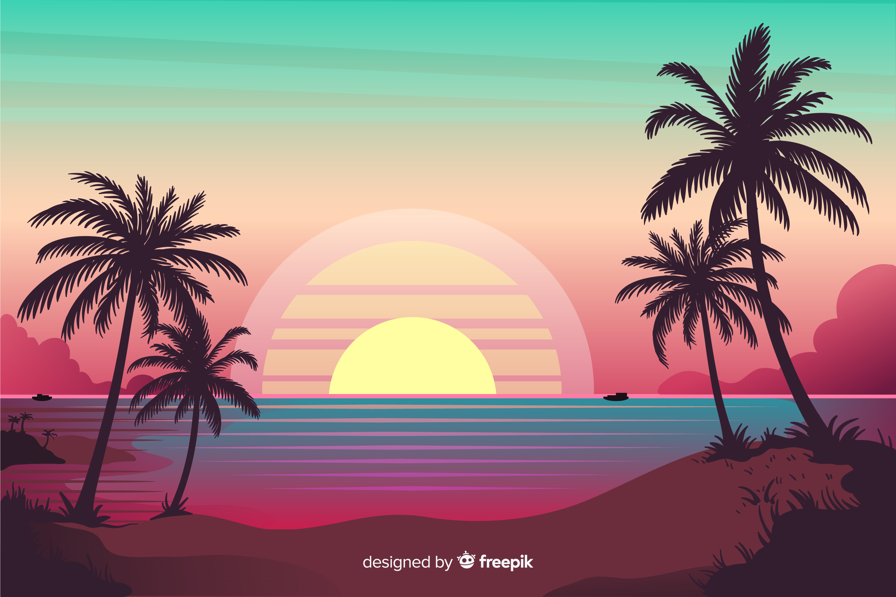
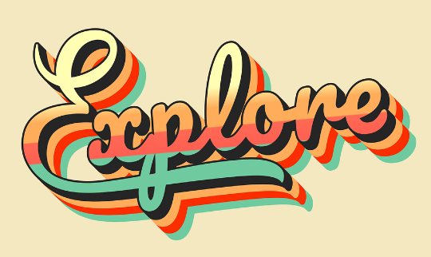

# :sunny: **InstaTrip** :sunny:
## *For When You Want to Travel, But Decision-Making Isn’t Your Thing* 

  

[Visit the deployed site](https://instatrip-ffc10cb98741.herokuapp.com/)

# **Introduction**

Crave the magic of adventure but need the security of cold, hard data? Welcome to **InstaTrip**, your source for perfectly planned travel spontaneity (courtesy of a Google Sheet)

InstaTrip asks you a few simple questions (nothing too deep!), then compiles a hand-picked list of European destinations based on your preferences. Fancy a quick solo trip to Bucharest? A hen party in Amsterdam? Maybe a spicy weekend for two in Istanbul? We’ve got you covered. We'll match the occasion of your trip to your chosen interests: Shopping? *Check.* Dining? *Absolutely.* Nightlife? *Cheers!*

But that's not all, reader. **InstaTrip** even saves you the trouble of flight searching. Thanks to the Ryanair API, we’ll show you the cheapest ticket to your destination. Decision fatigue is real, so help us help you. No need to spend hours searching for flights-- that's time better spent agonizing over how to fit your entire wardrobe + toiletries into a 40cm x 20cm bag :fearful:

Don't forget your passport!

# **Table of Contents**
- [Project](#project)
  - [How to Use InstaTrip](#how-to-use-instatrip)
  - [Target Audience](#target-audience)
  - [User Stories](#user-stories)
  - [Site Owner's Goal](#site-owners-goal)
  - [Features to Achieve the goals](#features-to-achieve-the-goals)
- [User Experience](#user-experience)
  - [Program Structure](#program-structure)
  - [Flowchart](#flowchart)
  - [Database Structure](#database-structure)
      - [Google Sheet](#google-sheet)
      - [Ryanair API](#ryanair-api)
  - [Logic Flow](#logic-flow)
  - [Design Choices](#design-choices)
- [Features](#features)
- [Future Features](#future-features)
- [Technologies](#technologies)
  - [Languages](#languages)
  - [Libraries, Programs, and Tools](#libraries-programs-and-tools)
- [Testing](#testing)
  - [Code Validation](#code-validation)
  - [Feature Testing](#feature-testing)
  - [Additional Testing](#additional-testing)
  - [Bugs](#bugs)
- [Deployment](#deployment)
- [Credits](#credits)
- [Acknowledgements](#acknowledgements)
- [Contact](#contact)

# Project 

This program was created for Portfolio Project #3 (Python Essentials) for The Code Institute Full Stack Software Developer program

## How to Use InstaTrip

1. Navigate to `https://instatrip-ffc10cb98741.herokuapp.com`or [click this link](https://instatrip-ffc10cb98741.herokuapp.com/)
2. Click the *Run Program* button at the top of the page
3. Follow the instructions on the main menu to either read *about* the program or *start* it
4. After starting the program, answer the questions and select your vacation preferences. Then choose from the cities presented and receive the cheapest flight for your preferred destination. You may then copy the provided link and purchase the flight from Ryanair, *start over* to select new cities, or *exit* the program

## Target Audience
*InstaTrip* is intended for adults (and young people with parental supervision) of all walks of life, based in Ireland and/or within reasonable travelling distance to Dublin airport: People who would like to explore spontaneous European travel. This program is designed to inspire joy.  From the colors to the playful tone, whether the user is landlocked or ready for takeoff, **InstaTrip** encourages them to imagine the excitement and anticipation that accompanies planning a big trip. Use it as inspiration, use it for fun, or use it to plot the next great escape from the daily routine :sparkles:

## User Stories
   

   
User Stories for Instatrip (click)

 
 - **As a new visitor**, I want:
    - Story 1
    - Story 2 etc
   
 - **As a returning visitor**, I want:
    - Story 1
    - Story 2 etc
    

## Site Owner's Goal
   

   
Site Owner's Goal (click)

  - **As the owner of the site**, I want:
    - Story 1
    - Story 2 etc
    

## Features to Achieve the Goals

# User Experience

## Program Structure

**Instatrip** is a terminal-based application housed on a landing page and deployed by Heroku. It is fueled by two core modalities, each backed by an API. The first is a data collection process to determine the user's ideal European destination, as ranked by their input and compared with a Google Sheet of relevant values. The second is a flight retrieval process by which the Ryanair API selects the cheapest flight based on the parameters decided above.

More about each of these processes can be found in the [flowchart](<#flowchart>) and [database structure]((<#database-structure>)) sections. The logic behind them and the experience navigating through the program can be found in the [Features](<#features>) section.

## Flowchart  

 Instatrip Flowchart 

  
  

The flow chart for this application was originally designed with pen and paper before I began coding. I used Visio once I had an idea of the general structure for **InstaTrip** and had the first few functions in place. This helped me flesh out the details, stay organized, and create the necessary bridges between functions as the logic of the program grew in complexity

## Database Structure 

### Google Sheet

 Instatrip Google Sheet 

  
  

My introduction to Google Sheets was from Code Institute's extremely helpful *Love Sandwiches* walkthrough project. I have often said I am not a "spreadsheet person" to my Business Analyst husband, despite my love and need for organization. I was more than pleasantly surprised by the ease of use incorporating these Sheets into both the walkthrough and my own project, and can now officially designate myself a Sheet Believer :sparkle:

My Workbook *Instatrip* consists of a single Sheet. This Sheet is composed of 17 columns, 15 of which form the parameters for the user's travel preferences; and 32 rows, with each row representing a European city.

The column titles are as follows: City, IATA (airport code), Nightlife, History & Culure, Cuisine, Outdoorsy Experiences, Shopping, Off the Beaten Path Exploration, Romantic Adventure, Solo Travel, Hen or Stag Party, Time with Friends or Family, Overall Safety, Accessibility, Public Transportation, Tourism-Friendliness, and English-Speaking

Data to rank each city with a numeric value from 1-5 to populate each of the column parameters was collected first from google, and then with the aid of ChatGPT. The program compares these numeric rankings with the user's own rankings to determine which cities make the most suitable destinations 

### Ryanair API

## Logic Flow

## Design Choices

### Color Scheme

The color and design scheme for the starting screen of **Instatrip** was chosen to give a slightly retro feel, intended to evoke nostalgia-- the travel agencies and city destination posters of yesteryear. The background image for the page, an island sunset, inspired the color choice for the rest of the program. 

While this project by nature limits styling liberties, I enjoyed colorizing the text and making generous use of emoji to compliment the fun, light-hearted tone set by the copy. Booking flights and tending to travel details can often be a dreary affair. The aim here is to break the tedium and usher in a bit of excitement

    
    
    
    

- Color for the text was provided by the [Colorama library](https://pypi.org/project/colorama/). The primary colors of choice were Cyan and Magenta, to compliment the background image behind the terminal. Red was used for exception messages. Red and two tones of Yellow colorized the *Start* screen

- Emoji were taken from the [Emoji for Python library](https://pypi.org/project/emoji/). When using human emoji characters, I made every effort to choose different skintones and genders for inclusivity

### ASCII ART (spelling?)

- ASCII Art for the logo and exit screen has been provided by ----.  
    
  

  
  

# Features

I have aimed to give this site a simple, intuitive interface. Ease of navigation allows the visitor to 

Examples of this site's interactive features include:
 
- Example 1
- Example 2

## Favicon

  

- The favicon features 

## Feature 1

- Explanation

### Feature 1 sub-feature

- Explanation

## Feature 2

### Sub-Feature

- Explanation

# Future Features
- FF1
- FF2

# Technologies

## Languages Used
- [Python](https://www./) - provides application functionality

## Libraries, Programs, and Tools
- [ChatGPT](https://openai.com/chatgpt/) - for help ranking tourist destinations by my chosen criteria
- [Coolors](https://coolors.co/) - to provide the README color palette
- [Freepik](https://www.freepik.com) - for all images
- [Github](https://github.com/) - to host the site ?
- [Gitpod](https://www.gitpod.io/#get-started) - to create and edit the site
- [Icons8](https://icons8.com/) - for -- favicon
- [Shields.io](https://shields.io/badges) - for README color badges

# Testing

## Code Validation

| W3 Validator | views.html | 
|--------------|------------|
| html         | Pass       |

| Python De-linter | run.py | 
|--------------|------------|
| python         | Pass       |

I ran the views.html page housing the terminal through the W3 validator after changing the background. Thankfully, this adjustment caused no errors and the page passed validation.

The Python de-linter----

## Feature Testing 

### Feature Testing Table

 
A Table of Feature Tests (click)

| Feature                     | Test Case                 | Outcome                   |
|-----------------------------|---------------------------|---------------------------|
| Favicon | Load Site | Icon and title appear in tab |
| **Section 1**  |
| Feature | Test | Outcome |
| Feature | Test | Outcome |
| **Section 2**  |
| Feature | Test | Outcome |
| Feature | Test | Outcome |

### Feature Testing Images

  
Testing the --(click)
 

- Feature action 1
- Feature action 2

- Feature action 1
- Feature action 2

### HTML Validation
- [W3C HTML Validator](https://validator.w3.org/) -

    
HTML Validation Screenshot (click)

     
     
No errors were returned

  

### Python Validation
- [Python -- Validator](https://) -

    
Python Validation Screenshot (click)

     
     
     
No errors returned. etc

  

## Additional Testing

### Lighthouse

  
Lighthouse Test Results: Mobile (click)
 

  
Lighthouse Test Results: Desktop (click)
 

### WAVE Testing

  
WAVE Web Accessibility Evaluation Tool (click)
 

Explanation

### Accessibility
This website was developed with special consideration for accessibility through the following methods:
- Accessibility methods
- Accessibility methods 2

### Manual Testing

if applicable

  
Screenshots of each area of the site as tested on Am I Responsive? (click)

   

   
   
   
   
   
   
   

  
Screenshots of each area of the site as tested on my own device, iPhone 13Pro (click)

   

   
   
   
   
   
   
   

  
Screenshots of each area of the site as tested on iPhone 11 (click)

  

   
   
   
   
   
   
   

  
Screenshots of each area of the site as tested on HP Elitebook (click)

   

   
   
   
   
   
   
  

   

  
Screenshots of each area of the site as tested on Dell Latitude 5430 (1920px x 1080px) (click)

  

   
   
   
   
   
   
  

# Bugs

## Solved Bugs

  
Bug title (click)

Explanation and resolution

## Unsolved Bugs

After implementing the above solutions and running all code through the necessary validators, remaining bug

  
Bug title

explanation

Further areas of note

# Deployment

## To Deploy The Project on Heroku

  
How to Deploy with Heroku(click)
 

This site was deployed through Heroku [/?](https://)

1. Instructions 1

2. Instructions 2

## To Fork The Repository on GitHub

  
How to fork the **InstaTrip** repository (click)

To make a copy of a repository, fork it through Github:

1. Find the repository either by using the search bar or by navigating to the URL [/erinvdoyle/instatrip](https://github.com/erinvdoyle/instatrip)
2. Once on the repository main page, navigate to the "Fork" button in the upper-right corner, between the "Watch"("Unwatch" in the image as I am the repository owner and watcher) and "Star" buttons

3. Click the "Fork" button to create a copy of the repository. This copy be altered without affecting the source code

## Creating A Local Clone of The Project

  
How to create a local clone (click)

To clone the repository of this site:

1. Click the "Code" button in your forked repository

2. Copy the repository URL (HTTPS, SSH, or GitHub CLI)
3. Open a terminal (or command prompt) on your computer

 

4. Type the following command: git clone https://github.com/erinvdoyle/instatrip.git to create a local clone

# Credits
[Retro Logo Inspiration by Sundhar on Dribble](https://dribbble.com/shots/7900685-Retro-Logo-Design)

## Content

## Technical Content

All tutorials used have been credited throughout the code. Tutorials were consulted as a jumping off point and code was manipulated to perform per my own design and specification

### Python Tutorials

["Python Datetime" Tutorial](https://www.w3schools.com/python/python_datetime.asp)

[Tutorial summary and title"](https://)

## Media
### Image Credits
[Main Image by FreePik](https://www.freepik.com/free-vector/gradient-beach-sunset-landscape_4636385.htm)

### Other Resources
If applicable

# Acknowledgements
- My mentor, Precious Ijege, for helping me make sure all my exceptions were handled, providing kind guidance from project inception to completion, and allowing me to see the project with fresh eyes.
- Our cohort standup leader, Kay Welfare, for providing a weekly dose of enthusiasm and encouragement
- The CI Hackathon staff and my Elevate Hackathon teammates (Team ResuMates!) for inspiration and the opportunity to experience working as part of a team
- My husband, Taylor, process mapper extraordinaire, for helping me tighten up my flow chart. And *especially* for taking care of our horses and household during Storm Ashley to allow me long hours to complete the bulk of this project

# Contact
Thank you for viewing this project. Please feel free to contact me with any questions, comments, or opportunities
  
 - [erin.v.doyle@gmail.com](mailto:erin.v.doyle@gmail.com)
 - [linkedin.com/erinvdoyle](https://linkedin.com/erinvdoyle)
